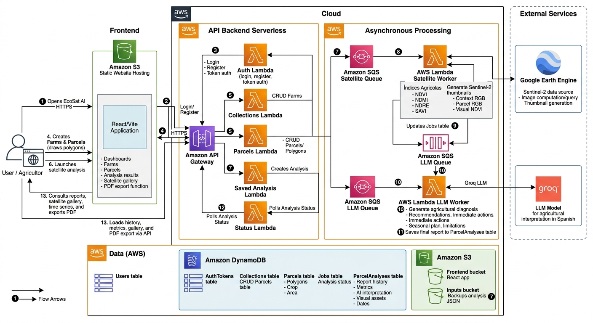

# EcoSat AI

EcoSat AI es una plataforma serverless de monitoreo agricola satelital con IA. Permite registrar fincas y lotes mediante poligonos, ejecutar analisis asincronos sobre imagenes Sentinel-2, calcular indices agricolas y traducir esos resultados en recomendaciones entendibles para agricultores y tecnicos de campo.

La solucion combina AWS Serverless, Google Earth Engine y Groq para convertir datos satelitales en diagnosticos accionables sobre vigor, humedad, nutricion y prioridad de atencion del cultivo.

## Contexto del Problema

Muchos agricultores y administradores de parcelas no cuentan con herramientas accesibles para monitorear sus cultivos de forma frecuente. Aunque indices como NDVI, NDMI o NDRE son ampliamente usados en agricultura de precision, su interpretacion requiere conocimientos tecnicos. En la practica, esto limita su adopcion por usuarios no especializados.

EcoSat AI resuelve este problema con una interfaz simple donde el usuario dibuja o registra sus lotes, lanza analisis satelitales y recibe reportes explicados en lenguaje natural. El valor principal no es solo calcular indices, sino transformar esos valores en acciones concretas: revisar riego, priorizar fertilizacion, monitorear sectores con bajo vigor o comparar la evolucion del lote entre temporadas.

## Casos de Uso

- Registrar fincas y lotes agricolas mediante poligonos.
- Calcular area estimada del lote en m2 y hectareas.
- Ejecutar analisis sobre un lote especifico o sobre todos los lotes de una finca.
- Procesar lotes de forma asincrona mediante colas.
- Calcular indices Sentinel-2: NDVI, NDMI, NDRE y SAVI.
- Generar diagnosticos con Groq en espanol y lenguaje no tecnico.
- Consultar historial de analisis por lote.
- Comparar cambios entre epocas mediante series temporales.
- Visualizar galeria satelital con RGB, NDVI y contexto Sentinel-2.
- Exportar reportes en PDF imprimible.
- Eliminar analisis de prueba o reportes antiguos.

## Impacto Esperado

EcoSat AI busca democratizar el monitoreo agricola satelital para agricultores, cooperativas y pequenos equipos tecnicos. La solucion reduce la brecha entre datos satelitales complejos y decisiones agronomicas simples, permitiendo:

- deteccion temprana de estres hidrico,
- priorizacion de zonas con bajo vigor,
- seguimiento historico de parcelas,
- mejor planificacion de riego y fertilizacion,
- evidencia visual del estado del cultivo por periodo.

## Arquitectura de Solucion

La arquitectura es predominantemente serverless, orientada a eventos y asincrona. La maquina virtual solo se usa como entorno de despliegue durante el desarrollo; la aplicacion desplegada funciona sobre servicios administrados.



## Flujo de Eventos

1. El usuario abre EcoSat AI desde Amazon S3 Static Website Hosting.
2. El frontend se comunica con API Gateway mediante HTTPS.
3. El usuario se registra o inicia sesion; Auth Lambda guarda tokens con expiracion en DynamoDB.
4. El usuario crea fincas y lotes; Parcels Lambda almacena poligonos, cultivo, area m2 y area ha.
5. El usuario lanza un analisis para uno o varios lotes.
6. Saved Analysis Lambda crea un `analysis_id`, genera un job por lote y guarda inputs en S3.
7. Saved Analysis Lambda publica eventos en SQS Satellite Queue.
8. Satellite Worker consume cada evento, consulta Google Earth Engine y calcula indices.
9. Satellite Worker genera visuales Sentinel-2: contexto RGB, RGB del lote y NDVI visual.
10. Satellite Worker actualiza Jobs Table y publica un evento en SQS LLM Queue.
11. LLM Worker llama a Groq, interpreta los indices y genera recomendaciones.
12. LLM Worker guarda el reporte final en ParcelAnalyses Table.
13. El frontend consulta Status Lambda para mostrar progreso.
14. El usuario visualiza metricas, diagnostico IA, galeria satelital, serie temporal y PDF.

## Servicios de Nube Utilizados

### AWS

- Amazon S3:
  - hosting estatico del frontend,
  - almacenamiento de inputs JSON.
- Amazon API Gateway:
  - API REST publica.
- AWS Lambda:
  - funciones API,
  - workers asincronos.
- Amazon SQS:
  - cola de procesamiento satelital,
  - cola de interpretacion LLM,
  - DLQ para no perder eventos fallidos.
- Amazon DynamoDB:
  - usuarios,
  - tokens,
  - fincas,
  - lotes,
  - jobs,
  - historial de reportes.

### Servicios Externos

- Google Earth Engine:
  - consulta de Sentinel-2 SR Harmonized,
  - calculo de indices espectrales,
  - generacion de miniaturas satelitales.
- Groq:
  - interpretacion LLM de indices y contexto agricola.

## Indices Agricolas

- NDVI: vigor y biomasa del cultivo.
- NDMI: humedad del cultivo y posible estres hidrico.
- NDRE: clorofila/nutricion, util para detectar deficiencias nutricionales.
- SAVI: vigor corregido por efecto del suelo, util en cultivos jovenes o ralos.

Se reemplazo NBR porque es mas apropiado para incendios/quemas y no para una mision centrada en plantaciones agricolas.

## Resiliencia y Manejo de Limites

La solucion esta disenada para procesar lotes de forma controlada:

- Un analisis puede crear multiples jobs, uno por lote.
- El limite de batch esta controlado en backend con `MAX_BATCH_SIZE = 30`.
- SQS desacopla la API del procesamiento pesado.
- Satellite Worker usa `functionResponseType: ReportBatchItemFailures`.
- LLM Worker tambien usa partial batch response para reintentar solo mensajes fallidos.
- Las colas tienen DLQ con retencion de 14 dias.
- Groq `RateLimitError` se captura y el mensaje vuelve a la cola para reintento.
- `reservedConcurrency: 2` limita el paralelismo del LLM Worker para no saturar la API.

## Estructura del Repositorio

```txt
ecosat-ai/
├── backend/
│   ├── api/
│   │   ├── auth.py
│   │   ├── collections.py
│   │   ├── parcels.py
│   │   ├── saved_analysis.py
│   │   ├── status.py
│   │   └── submit.py
│   ├── shared/
│   │   ├── auth.py
│   │   ├── crop_knowledge.py
│   │   └── vendor.py
│   ├── workers/
│   │   ├── satellite.py
│   │   └── llm.py
│   ├── requirements.txt
│   └── serverless.yml
├── frontend/
│   ├── src/
│   │   ├── api/
│   │   ├── components/
│   │   ├── context/
│   │   ├── pages/
│   │   └── utils/
│   ├── index.html
│   └── package.json
└── README.md
```

## Requisitos

- Node.js 18 o superior.
- Python 3.12 para Lambda.
- Serverless Framework.
- AWS CLI configurado.
- Cuenta AWS Academy/Learner Lab o una cuenta AWS con permisos equivalentes.
- Cuenta de Google Earth Engine habilitada.
- Service Account de Google Cloud con permisos de Earth Engine.
- API key de Groq.

## Variables de Entorno del Backend

Configurar antes de ejecutar `sls deploy`:

```bash
export GROQ_API_KEY="gsk_..."
export GEE_PROJECT="ecosat-ai"
export GEE_SERVICE_ACCOUNT="ecosat-worker@ecosat-ai.iam.gserviceaccount.com"
export GEE_SERVICE_ACCOUNT_JSON='{"type":"service_account", ... }'
```

El archivo de referencia esta en:

```txt
backend/.env.example
```

### Permisos de Google Earth Engine

La cuenta de servicio debe poder:

- consultar colecciones Sentinel-2,
- calcular reducciones,
- crear thumbnails.

Si aparecen errores como:

```txt
Permission 'earthengine.thumbnails.create' denied
```

asignar a la cuenta de servicio un rol de Earth Engine con permisos de escritura/generacion de recursos, por ejemplo `Earth Engine Resource Writer` o, para demo, un rol administrativo equivalente dentro del proyecto de Google Cloud.

## Variables de Entorno del Frontend

Crear `frontend/.env`:

```env
VITE_API_BASE_URL=https://<api-id>.execute-api.us-east-1.amazonaws.com/dev
```

Tambien se acepta:

```env
VITE_API_URL=https://<api-id>.execute-api.us-east-1.amazonaws.com/dev
```

No incluir secretos en el `.env` del frontend. Las variables de Vite quedan embebidas en el build.

## Despliegue del Backend

Desde la instancia o maquina con credenciales AWS:

```bash
cd backend
sls deploy --force
```

El despliegue crea:

- API Gateway,
- Lambdas,
- SQS queues y DLQ,
- DynamoDB tables,
- S3 input bucket,
- S3 frontend bucket.

Consultar endpoints:

```bash
sls info
```

## Empaquetado de Dependencias Python

El proyecto usa dependencias Python como `earthengine-api`, `groq` y librerias de Google. Para Lambda se recomienda empaquetarlas en `backend/vendor` usando binarios compatibles con Python 3.12:

```bash
cd backend
rm -rf vendor .serverless
python3 -m pip install \
  --platform manylinux2014_x86_64 \
  --implementation cp \
  --python-version 3.12 \
  --only-binary=:all: \
  -r requirements.txt \
  -t vendor
sls deploy --force
```

Esto evita errores como `No module named ee` o incompatibilidades con `_cffi_backend`.

## Despliegue del Frontend en S3

Configurar `frontend/.env` con la URL de API Gateway y construir:

```bash
cd frontend
npm install
npm run build
```

Subir el build al bucket S3 creado por Serverless:

```bash
aws s3 sync dist/ s3://ecosat-backend-frontend-dev-285023351044 --delete
```

Forzar que `index.html` no quede cacheado:

```bash
aws s3 cp dist/index.html s3://ecosat-backend-frontend-dev-285023351044/index.html \
  --cache-control "no-cache, no-store, must-revalidate" \
  --content-type "text/html"
```

URL publica esperada:

```txt
http://ecosat-backend-frontend-dev-285023351044.s3-website-us-east-1.amazonaws.com
```

Si el account ID cambia, obtener el nombre del bucket desde:

```bash
cd backend
sls info
aws s3 ls
```

## Ejecucion Local del Frontend

```bash
cd frontend
npm install
npm run dev
```

Para apuntar al backend desplegado:

```env
VITE_API_BASE_URL=https://<api-id>.execute-api.us-east-1.amazonaws.com/dev
```

## Prueba Rapida de la API

### Registro

```bash
curl -X POST "https://<api-id>.execute-api.us-east-1.amazonaws.com/dev/auth/register" \
  -H "Content-Type: application/json" \
  -d '{"name":"Demo","email":"demo@test.com","password":"12345678"}'
```

### Login

```bash
curl -X POST "https://<api-id>.execute-api.us-east-1.amazonaws.com/dev/auth/login" \
  -H "Content-Type: application/json" \
  -d '{"email":"demo@test.com","password":"12345678"}'
```

Guardar:

- `tenant_id`
- `token`

### Crear Finca

```bash
curl -X POST "https://<api-id>.execute-api.us-east-1.amazonaws.com/dev/collections" \
  -H "Content-Type: application/json" \
  -H "X-Tenant-Id: <tenant_id>" \
  -H "Authorization: Bearer <token>" \
  -d '{"name":"Finca Demo","description":"Demo hackathon"}'
```

### Crear Lote

```bash
curl -X POST "https://<api-id>.execute-api.us-east-1.amazonaws.com/dev/parcels" \
  -H "Content-Type: application/json" \
  -H "X-Tenant-Id: <tenant_id>" \
  -H "Authorization: Bearer <token>" \
  -d '{
    "collection_id": "<collection_id>",
    "name": "Lote 1",
    "crop_type": "maiz",
    "notes": "Lote demo",
    "area_m2": 128183,
    "area_ha": 12.82,
    "geometry": {
      "type": "Polygon",
      "coordinates": [[[-76.52,-8.18],[-76.50,-8.18],[-76.50,-8.16],[-76.52,-8.16],[-76.52,-8.18]]]
    }
  }'
```

### Lanzar Analisis

```bash
curl -X POST "https://<api-id>.execute-api.us-east-1.amazonaws.com/dev/analysis/saved" \
  -H "Content-Type: application/json" \
  -H "X-Tenant-Id: <tenant_id>" \
  -H "Authorization: Bearer <token>" \
  -d '{
    "parcel_ids": ["<parcel_id>"],
    "date_start": "2025-01-01",
    "date_end": "2025-06-01",
    "indices": ["NDVI", "NDMI", "NDRE", "SAVI"]
  }'
```

### Consultar Estado

```bash
curl "https://<api-id>.execute-api.us-east-1.amazonaws.com/dev/analysis/<analysis_id>/status" \
  -H "X-Tenant-Id: <tenant_id>" \
  -H "Authorization: Bearer <token>"
```

## Endpoints Principales

| Metodo | Ruta | Descripcion |
|---|---|---|
| POST | `/auth/register` | Registrar usuario |
| POST | `/auth/login` | Iniciar sesion |
| GET | `/auth/me` | Validar sesion |
| POST | `/auth/logout` | Cerrar sesion |
| GET/POST | `/collections` | Listar/crear fincas |
| PUT/DELETE | `/collections/{collection_id}` | Actualizar/eliminar finca |
| GET/POST | `/parcels` | Listar/crear lotes |
| GET/PUT/DELETE | `/parcels/{parcel_id}` | Obtener/actualizar/eliminar lote |
| POST | `/analysis/saved` | Lanzar analisis asincrono sobre lotes guardados |
| GET | `/analysis/{id}/status` | Consultar progreso del analisis |
| GET | `/parcels/{parcel_id}/analyses` | Historial de reportes |
| DELETE | `/parcels/{parcel_id}/analyses/{analysis_record_id}` | Eliminar reporte historico |
| GET | `/parcels/{parcel_id}/summary` | Resumen y serie temporal |
| GET | `/collections/{collection_id}/summary` | Ranking y resumen de finca |

## Modelo de Datos

### Users

- `tenant_id`
- `email`
- `name`
- `password_hash`
- `status`

### AuthTokens

- `tenant_id`
- `token_id`
- `token_hash`
- `expires_at`

### Collections

- `tenant_id`
- `collection_id`
- `name`
- `description`
- `created_at`
- `updated_at`

### Parcels

- `tenant_id`
- `parcel_id`
- `collection_id`
- `name`
- `geometry`
- `crop_type`
- `area_m2`
- `area_ha`
- `notes`

### Jobs

- `job_id`
- `analysis_id`
- `tenant_id`
- `parcel_id`
- `status`
- `indices_stats`
- `visual_assets`

### ParcelAnalyses

- `tenant_id`
- `analysis_record_id`
- `analysis_id`
- `job_id`
- `parcel_id`
- `collection_id`
- `date_start`
- `date_end`
- `indices_stats`
- `visual_assets`
- `interpretacion_ia`
- `created_at`

## Funcionalidades del Frontend

- Registro y login.
- Dashboard general.
- CRUD de fincas.
- Creacion de lotes con poligono en mapa.
- Calculo local de area aproximada.
- Analisis por lote o por todos los lotes de una finca.
- Banner de progreso del analisis.
- Tarjetas de metricas.
- Diagnostico IA.
- Recomendaciones, acciones inmediatas y plan de temporada.
- Galeria satelital por fecha.
- Serie temporal por indice.
- Exportacion a PDF.
- Eliminacion de analisis.

## Video Demo

El video de demostracion de la plataforma se encuentra en la siguiente carpeta:

```txt
https://drive.google.com/drive/folders/1EjcXPjIw6GqmysXsqVS4wvFNIP1itqZq?usp=sharing
```

## Enlace del Frontend Desplegado

Agregar la URL final del bucket S3:

```txt
http://ecosat-backend-frontend-dev-285023351044.s3-website-us-east-1.amazonaws.com
```

## Docker

No se utiliza Docker en la solucion final. La arquitectura fue implementada con servicios serverless y administrados. La maquina virtual usada durante el desarrollo/despliegue no forma parte del runtime de la aplicacion.

## Limitaciones

- Sentinel-2 tiene resolucion de 10 a 20 metros, por lo que el analisis es por lote o sector, no por planta individual.
- La nubosidad puede reducir la calidad o frecuencia de imagenes utiles.
- Las miniaturas de Earth Engine dependen de permisos del service account y disponibilidad temporal de URLs.
- El LLM no reemplaza la validacion agronomica en campo; genera recomendaciones de apoyo.

## Estado del Proyecto

Proyecto implementado para hackathon cloud con:

- frontend desplegable en S3,
- backend serverless en AWS,
- procesamiento asincrono con SQS,
- calculo satelital en Google Earth Engine,
- interpretacion con Groq LLM,
- historial y reportes por lote.
